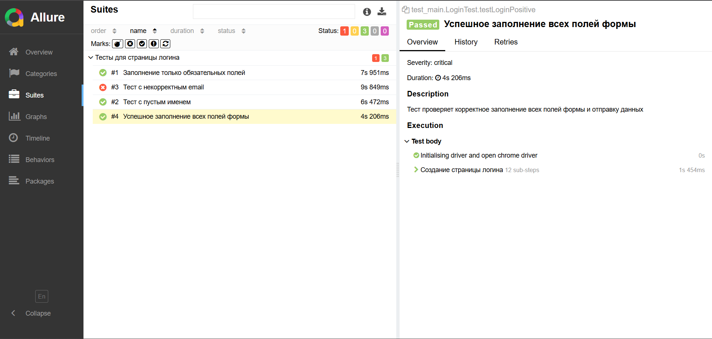
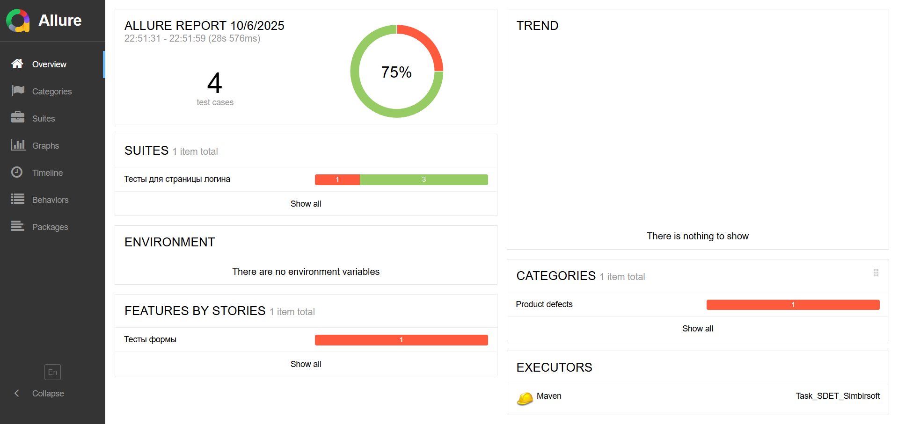
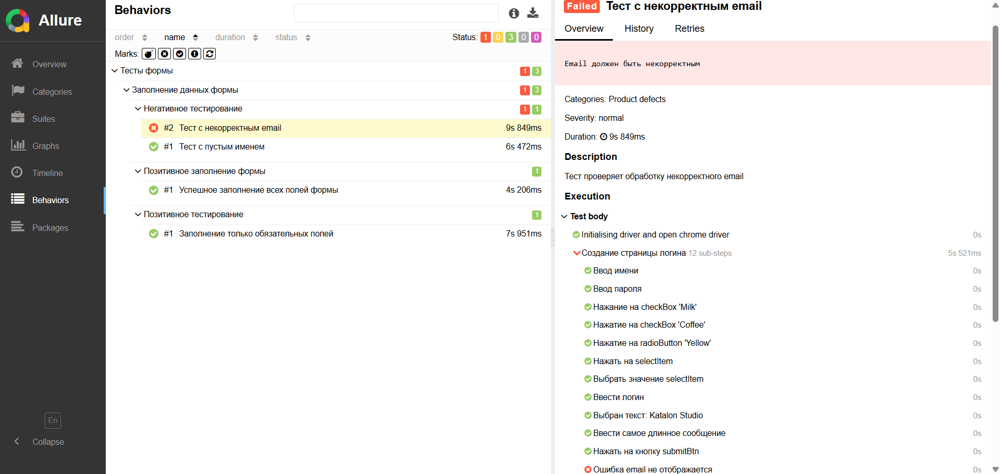

<h1>Task_SDET_Simbirsoft</h1>

<h2>Решение ТЗ для отбора на практикум SDET на Java</h2>

<strong>Инструменты:</strong> <em>(Язык <strong>Java 17</strong>, тестовый фреймворк <strong>JUint 4/5</strong>, сборщик проектов <strong>Maven</strong>)</em>

<h3>Важно</h3>

<h4>1. Проблема с кликабельностью элементов в Selenium</h4>

<strong>Проблема:</strong> Некоторые элементы на странице не реагируют на стандартные методы Selenium <code>click()</code>.

<strong>Решение:</strong> Использовать выполнение JavaScript через <code>execute_script("arguments[0].click();", element)</code>

<h4>2. Стратегия тестирования (Позитивные и Негативные сценарии)</h4>

<h5>Позитивный тест-кейс:</h5>
<ul>
  <li><strong>Цель:</strong> Проверить, что форма успешно отправляется при заполнении всех <strong>валидных данных</strong>.</li>
  <li><strong>Ожидаемый результат:</strong> Появление всплывающего окна, подтверждающего успешную отправку.</li>
</ul>

<h5>Негативный тест-кейс:</h5>
<ul>
  <li><strong>Цель:</strong> Проверить поведение системы, когда обязательное поле <strong>не заполнено</strong>.</li>
  <li><strong>Ключевое наблюдение:</strong> Единственное обязательное поле, проверяемое негативным сценарием — это поле <strong>"Name"</strong>.</li>
  <li><strong>Ожидаемое поведение при ошибке:</strong>
      <ul>
          <li>Сообщение об ошибке <em>не</em> появляется.</li>
          <li>Происходит автоматическая прокрутка (scroll) к незаполненному полю "Name".</li>
          <li><strong>Главный индикатор неудачи:</strong> Alert <strong>не</strong> появляется.</li>
      </ul>
  </li>
</ul>

<strong>Тест считается упавшим</strong>, если при невалидных данных (пустое имя или неправильный email) появляется Alert.

<strong>Тест проходит</strong>, когда система правильно блокирует отправку формы при ошибках валидации.

<h3>Положительный тест-кейс №1</h3>
<h4>Заполнение всех полей формы</h4>

  <strong>Предусловие:</strong>
  <ul>
      <li>Открыта страница в браузере</li>
  </ul>

  <strong>Шаги:</strong>
  <ol>
      <li>Заполнить поле <code>Name</code></li>
      <li>Заполнить поле <code>Password</code></li>
      <li>Нажать на checkBox <code>Milk</code> и <code>Coffee</code></li>
      <li>Нажать на checkBox <code>Yellow</code></li>
      <li>Нажать на список с текстом <code>Do you like automation?</code></li>
      <li>Выбрать любое значение из списка</li>
      <li>Заполнить поле Email форматом name@example.com</li>
      <li>В поле Message написать инструмент из списка <code>Automation tools</code>, содержащий наибольшее количество символов</li>
      <li>Нажать на кнопку <code>Submit</code></li>
  </ol>

  <strong>Ожидаемый результат</strong> - Появление окна сообщения Alert с текстом <code>Message received!</code>

<h3>Положительный тест-кейс №2</h3>
<h4>Заполнение только обязательных полей</h4>

  <strong>Предусловие:</strong>
  <ul>
      <li>Открыта страница в браузере</li>
  </ul>

  <strong>Шаги:</strong>
  <ol>
      <li>Заполнить поле <code>Name</code></li>
      <li>Нажать на кнопку <code>Submit</code></li>
  </ol>

  <strong>Ожидаемый результат</strong> - Появление окна сообщения Alert с текстом <code>Message received!</code>

<h3>Негативный тест-кейс №1</h3>
<h4>Тест с пустым именем</h4>

  <strong>Предусловие:</strong>
  <ul>
      <li>Открыта страница в браузере</li>
  </ul>

  <strong>Шаги:</strong>
  <ol>
      <li>Заполнить поле <code>Password</code></li>
      <li>Нажать на checkBox <code>Milk</code> и <code>Coffee</code></li>
      <li>Нажать на checkBox <code>Yellow</code></li>
      <li>Нажать на список с текстом <code>Do you like automation?</code></li>
      <li>Выбрать любое значение из списка</li>
      <li>Заполнить поле Email форматом name@example.com</li>
      <li>В поле Message написать инструмент из списка <code>Automation tools</code>, содержащий наибольшее количество символов</li>
      <li>Нажать на кнопку <code>Submit</code></li>
  </ol>

  <strong>Ожидаемый результат</strong> - Окно сообщения Alert с текстом <code>Message received!</code> не появилось, прокрутка к полю <code>Name</code>

<h3>Негативный тест-кейс №2</h3>
<h4>Тест с некорректным email</h4>

  <strong>Предусловие:</strong>
  <ul>
      <li>Открыта страница в браузере</li>
  </ul>

  <strong>Шаги:</strong>
  <ol>
      <li>Заполнить поле <code>Name</code></li>
      <li>Заполнить поле <code>Password</code></li>
      <li>Нажать на checkBox <code>Milk</code> и <code>Coffee</code></li>
      <li>Нажать на checkBox <code>Yellow</code></li>
      <li>Нажать на список с текстом <code>Do you like automation?</code></li>
      <li>Выбрать любое значение из списка</li>
      <li>Заполнить поле Email форматом <em>name-example.com</em> или <em>name@examle-com</em></li>
      <li>В поле Message написать инструмент из списка <code>Automation tools</code>, содержащий наибольшее количество символов</li>
      <li>Нажать на кнопку <code>Submit</code></li>
  </ol>

  <strong>Ожидаемый результат</strong> - Тест упал с сообщением <em>"Ошибка с email не отображается"</em> и <em>"Email должен быть некорректным"</em>, так как сайт не проверил формат почты, также окно сообщения Alert с текстом <code>Message received!</code> не появилось
<h2>Отчеты на Allure</h2>

  
  
   
  

<h2>Установка и запуск</h2>
<ol>
    <li>Клонировать репозиторий</li>
    <li>Перейти в ветку master</li>
    <li>Если вам нужен конректные тесты (Положительные или Негативные тесты), то запускайте методы с аннотаией @Test, находящиеся в классе LoginTest</li>
    <li>Если вам нужен тест какой-то из тест-кейса (функцию), то запускайте так - <code>mvn clean test</code>, а затем <code>mvn allure:serve</code></li>
    <li>Если сайт из allure-report не открывается, можете локально запустить свой - <code>allure serve results</code></li>
</ol>
